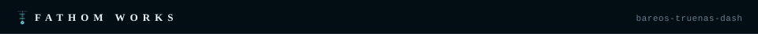

<p align="center"></p>

# `$ bareos-truenas-dash`

**Start and check your Bareos tape backups from one web page inside TrueNAS.** It shows your backup jobs, recent runs and tape status, so you don't need to open bareos-webui.

**In plain terms:** Bareos is backup software. This page is a simple control panel for it, made for people who run Bareos on a TrueNAS server.

*A [Fathom Works](https://github.com/Jemplayer82) project.*

## `[ what it does ]`

- **Run backups on demand.** One button per configured job.
- **Job status and history.** Recent runs, running jobs, and the last good backup per job.
- **Tape view.** Each tape (volume), its pool, status (Append/Full/Error) and last write.
- **Director health.** Shows the Director (the Bareos main service) version and whether the connection works.

> [!NOTE]
> Bareos itself runs in its own VM (TrueNAS can't host the Director natively). This dashboard is
> the TrueNAS-side control surface, deployed via **Apps → Custom App** so it lives in the TrueNAS
> UI. It talks to the Director's console port (9101) using a dedicated, ACL-restricted console
> credential — it can run and inspect, it cannot delete, purge, or prune.

## `[ quick start ]`

These commands install the app, create your settings file, and start it for testing. Fill in the Bareos console credential in `.env` first.

```bash
uv sync
cp .env.example .env   # fill in the Bareos console credential
uv run --env-file .env flask --app app run --debug
```

`python-dotenv` is not used — the app reads `os.environ` directly (defaults match `.env.example`; gunicorn/TrueNAS inject real values in production).

## `[ configuration ]`

Set these as environment variables (see [`.env.example`](.env.example)).

| Variable | What it does |
|---|---|
| `BAREOS_HOST` / `BAREOS_PORT` | Director address (console port, default 9101) |
| `BAREOS_CONSOLE_NAME` / `BAREOS_CONSOLE_PASSWORD` | The dedicated restricted console |
| `DASH_PORT` | Dashboard listen port |

## `[ deploy ]`

CI builds `ghcr.io/jemplayer82/bareos-truenas-dash` (`:latest` + `:sha`) on every push to
`master`, gated by a gitleaks secret scan. On TrueNAS: **Apps → Discover Apps → Custom App**,
point it at the image, pass the env vars above.

> [!IMPORTANT]
> Never `build: .` in compose — the image is always pulled pre-built from ghcr.

## `[ docs ]`

- [API reference](docs/api.md) — every endpoint the page uses
- [TrueNAS bridge runbook](docs/truenas-bridge-runbook.md)
- [Status and handoff](STATUS.md)

## `[ license ]`

Apache 2.0 — see [`LICENSE`](LICENSE).


